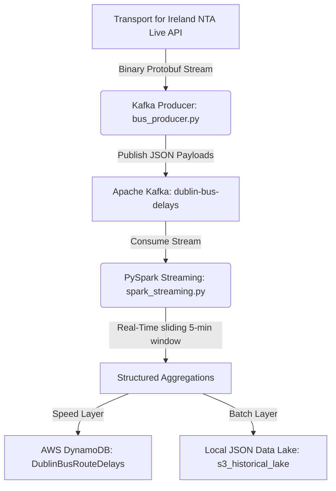

<<<<<<< HEAD
# Dublin Bus Real-Time Delay Analytics — Kinesis Producer

A high-performance real-time data ingestion pipeline that polls, parses, and streams Dublin Bus GTFS-Realtime (GTFS-RT) Trip Updates into AWS Kinesis Data Streams for downstream analytics.

---

## Project Overview

This project serves as the ingestion component (producer) of a scalable real-time speed/analytics layer for public transit delays in Dublin. It interfaces with the National Transport Authority (NTA) developer API, processes real-time Protocol Buffer (protobuf) feeds, structures the data into a flat JSON schema, and streams it to AWS Kinesis.

```
                  +--------------------------------+
                  |   National Transport Authority |
                  |    GTFS-RT protobuf Feed API   |
                  +---------------+----------------+
                                  |
                                  | HTTP Get (Protobuf)
                                  v
                  +---------------+----------------+
                  |   Dublin Bus Kinesis Producer  |
                  |     (Python Polling Loop)      |
                  +---------------+----------------+
                                  |
                                  | JSON records batch (PutRecords)
                                  v
                  +---------------+----------------+
                  |    AWS Kinesis Data Stream     |
                  |  (Route-ID Partitioned Shards) |
                  +--------------------------------+
=======
# 🇮🇪 Dublin Bus Live Delays Real-Time Streaming & Analytics Engine

A scalable, end-to-end real-time data streaming and analytics pipeline that ingests live GTFS-Realtime (GTFS-R) feed updates from the National Transport Authority (NTA) of Ireland, streams it through Apache Kafka, performs stateful windowed aggregations with PySpark, and outputs telemetry to both a serving database (AWS DynamoDB) and a local historical data lake.

## 👥 Authors & Contributors
This project was developed by:
*   **Kaustubh Anand Dinde**
*   **Aditi Shailendra Mohite**

---

## 🏗️ Architecture & Data Flow

The architecture follows a Lambda/Kappa-like hybrid pipeline designed to process real-time event telemetry:



1.  **Ingestion Layer ([bus_producer.py])**: 
    *   Polls the official TFI/NTA API for live GTFS Trip Updates.
    *   Parses binary Protobuf streams using `gtfs_realtime_pb2`.
    *   Extracts delay metrics (departure or arrival vectors) per route, trip, and stop.
    *   Serializes metrics to JSON and publishes them to Apache Kafka.
2.  **Streaming & Analytics Layer ([spark_streaming.py])**: 
    *   Consumes stream telemetry from Kafka brokers.
    *   Applies a stateful 5-minute sliding window (sliding every 1 minute) to compute average delays per route.
3.  **Hybrid Storage Layer**:
    *   **Speed/Serving Layer (DynamoDB)**: Updates micro-batch windowed aggregates inside an AWS DynamoDB table for rapid frontend query serving.
    *   **Batch Layer (Historical Lake)**: Backs up raw windowed aggregates locally in JSON-lines format, simulating an S3 historical storage lake.

---

## 🛠️ Tech Stack & Dependencies

*   **Language**: Python 3.x
*   **Message Broker**: Apache Kafka
*   **Stream Processing**: Apache Spark (Structured Streaming / PySpark)
*   **Cloud Serving Database**: AWS DynamoDB (Boto3 SDK)
*   **Data Formats**: Protocol Buffers (Protobuf) for live feed ingestion, JSON for streaming and historical backups

---

## ⚙️ Setup & Execution

### 1. Prerequisites
Ensure you have the following installed on your machine:
- Apache Kafka (running locally on port `9092`)
- Apache Spark (with Spark SQL Kafka integration support)
- Python packages:
  ```bash
  pip install kafka-python requests protobuf boto3 pyspark
  ```

### 2. AWS DynamoDB Configuration
Create a DynamoDB Table in the `us-east-1` region:
- **Table Name**: `DublinBusRouteDelays`
- **Partition Key**: `route_id` (String)
- **Sort Key**: `window_end` (String)

Ensure your environment has valid AWS credentials configured (typically in `~/.aws/credentials`) with permissions to write to DynamoDB.

### 3. Launching the Pipeline

#### Step A: Start Kafka and Create the Topic
First, make sure ZooKeeper and Kafka server are running. Then, create the telemetry topic:
```bash
kafka-topics.sh --create --topic dublin-bus-delays --bootstrap-server localhost:9092 --partitions 1 --replication-factor 1
```

#### Step B: Start the Ingestion Producer
Run the producer script to start fetching live updates and streaming them to Kafka:
```bash
python bus_producer.py
```

#### Step C: Start PySpark Stream Processing
Submit the Spark streaming app with the Kafka ingestion connector:
```bash
spark-submit --packages org.apache.spark:spark-sql-kafka-0-10_2.12:3.5.1 spark_streaming.py
>>>>>>> 3cb5306 (Initial commit)
```

---

<<<<<<< HEAD
## Core Features

- **Protobuf Processing:** Consumes and decodes the NTA GTFS-Realtime TripUpdates protocol buffer feed.
- **Data Enrichment:** Transforms hierarchical GTFS-RT feed updates into flat, structured JSON records with calculated delay values, timestamps, and route context.
- **AWS Kinesis Integration:** Utilizes Boto3 to stream batch updates using a partitioning scheme optimized for stream consumers.
- **Route-Based Partitioning:** Uses `route_id` as the partition key to ensure that updates for the same bus route are routed to the same Kinesis shard, maintaining sequential order.
- **Load Simulator & Benchmarker:** Includes a load simulator to capture live snapshots and replay them at amplified throughputs to benchmark ingestion limits, consumer scale, and latency.

---

## File Structure

| File | Description |
| :--- | :--- |
| [`kinesis_producer.py`](file:///Users/tigerbaby/Desktop/Badshah/Scalable/kinesis_producer.py) | Main ingestion application. Handles periodic polling of the NTA feed, parsing, batching, and writing to AWS Kinesis. |
| [`setup_kinesis.py`](file:///Users/tigerbaby/Desktop/Badshah/Scalable/setup_kinesis.py) | Utility script to initialize and tag the AWS Kinesis stream with proper partition shard configuration. |
| [`load_simulator.py`](file:///Users/tigerbaby/Desktop/Badshah/Scalable/load_simulator.py) | Simulation harness. Captures real-world bus delay snapshots and replays them at high rates to stress-test the data pipeline. |
| [`requirements.txt`](file:///Users/tigerbaby/Desktop/Badshah/Scalable/requirements.txt) | Project dependencies (Boto3, Requests, GTFS-RT bindings, Protobuf). |

---

## Record Schema

Each delay record emitted to AWS Kinesis follows this structured format:

```json
{
  "feed_timestamp": "2026-06-29T12:00:00+00:00",
  "ingestion_timestamp": "2026-06-29T12:00:01+00:00",
  "entity_id": "entity_123",
  "trip_id": "trip_456",
  "route_id": "46A",
  "direction_id": 0,
  "vehicle_id": "VH123",
  "stop_sequence": 5,
  "stop_id": "8220DB002081",
  "arrival_delay_s": 120,
  "departure_delay_s": 125,
  "schedule_relationship": "SCHEDULED"
}
```

### Schema Attributes

- `feed_timestamp`: The timestamp generated by the NTA when compiling the GTFS feed.
- `ingestion_timestamp`: The ISO 8601 UTC timestamp when the producer parsed and processed the record.
- `route_id` / `trip_id` / `stop_id`: Core identifiers linking the delay back to static GTFS schedule data.
- `arrival_delay_s` / `departure_delay_s`: Arrival/departure delays represented in seconds (negative values indicate early transit).

---

## Stream Partitioning Strategy

To guarantee sequential ordering of status updates for any individual route:
- The stream partition key is mapped directly to `route_id` (e.g., `"46A"`, `"39A"`).
- AWS Kinesis hashes this key to assign the record to a specific shard.
- Since records with the same partition key always route to the same shard, consuming frameworks (such as Apache Spark or AWS Lambda) can process updates for a single bus route in the exact chronological order they were produced.
=======
## 📊 Telemetry Schema Definitions

### Raw Kafka Payload Event
```json
{
  "timestamp": 1718029200,
  "route_id": "10-145-d1-1",
  "trip_id": "145_12345",
  "stop_id": "7582",
  "delay_seconds": 120
}
```

### AWS DynamoDB Table Item
*   `route_id` (String) - *Partition Key*
*   `window_end` (String) - *Sort Key*
*   `window_start` (String)
*   `average_delay_seconds` (String)
>>>>>>> 3cb5306 (Initial commit)
